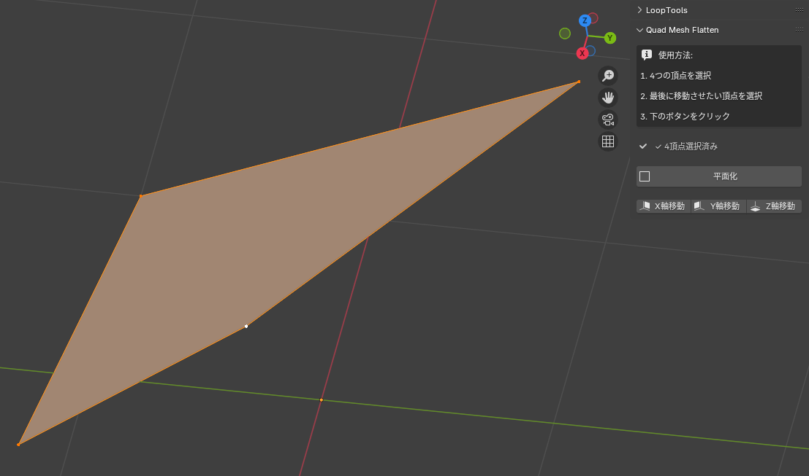

# Quad Mesh Flatten

A Blender addon that flattens quad meshes by selecting 4 vertices and projecting the 4th vertex onto a plane defined by the first 3 vertices.

## Features

- **Plane Projection**: Project the 4th vertex to a plane defined by 3 selected vertices
- **Axis-Constrained Movement**: Move vertices along X, Y, or Z axis to intersect with the plane
- **Real-time Selection Feedback**: Shows the number of selected vertices in the UI
- **Undo Support**: All operations support Blender's undo system

## Installation

1. Download the latest release from the [Releases](https://github.com/hip-claude/blender-quad-mesh-flatten/releases) page
2. In Blender, go to `Edit > Preferences > Add-ons`
3. Click `Install...` and select the downloaded `quad_mesh_flatten.py` file
4. Enable the addon by checking the box next to "Quad Mesh Flatten"

## Usage

1. Select a mesh object and enter Edit mode
2. Select exactly 4 vertices
3. The last selected vertex will be the one that gets moved
4. Open the sidebar (N key) and go to the "Edit" tab
5. Find the "Quad Mesh Flatten" panel
6. Choose one of the operations:
   - **平面化 (Flatten to Plane)**: Projects the vertex perpendicularly to the plane
   - **X軸移動 (Move along X)**: Moves the vertex only along the X-axis to intersect the plane
   - **Y軸移動 (Move along Y)**: Moves the vertex only along the Y-axis to intersect the plane
   - **Z軸移動 (Move along Z)**: Moves the vertex only along the Z-axis to intersect the plane

## Screenshots

### UI Panel

*The addon panel in Edit mode sidebar*

### Before and After Examples

#### Normal Plane Projection
| Before | After |
|--------|-------|
|  |  |
| *4 vertices selected (non-planar)* | *4th vertex projected to plane* |

#### Axis-Constrained Movement
| Before | After (X-axis) | After (Y-axis) | After (Z-axis) |
|--------|----------------|----------------|----------------|
|  |  |  |  |
| *Original quad mesh* | *Moved along X-axis* | *Moved along Y-axis* | *Moved along Z-axis* |

## Requirements

- Blender 2.80 or higher
- Works in Edit mode with mesh objects

## License

This project is licensed under the MIT License - see the [LICENSE](LICENSE) file for details.

## Contributing

Contributions are welcome! Please feel free to submit a Pull Request.

## Issues

If you encounter any problems or have suggestions, please open an issue on the [Issues](https://github.com/yourusername/blender-quad-mesh-flatten/issues) page.

## Changelog

### Version 1.0
- Initial release
- Basic plane projection functionality
- Axis-constrained movement options
- UI panel in Edit mode sidebar
