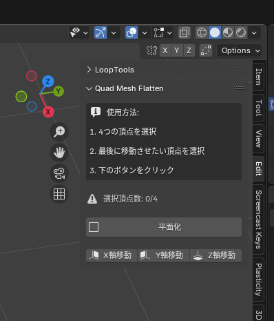
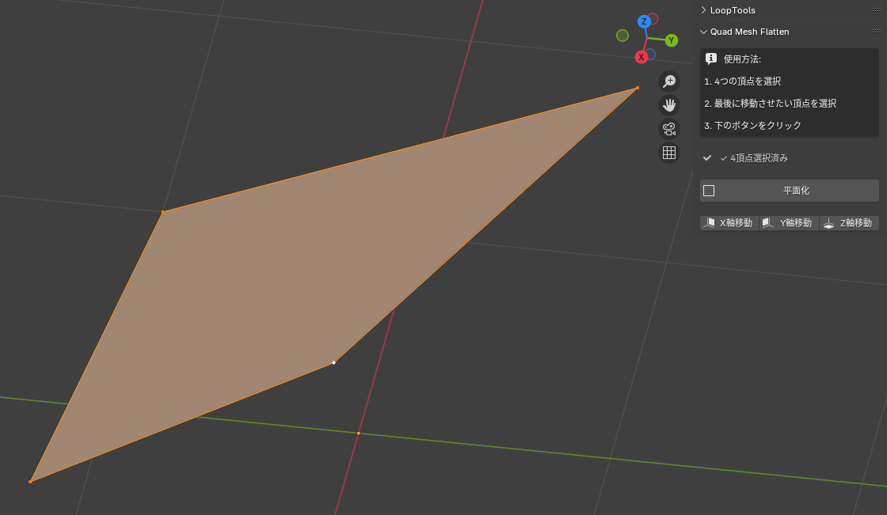

# Quad Mesh Flatten

4つの頂点を選択し、最初の3つの頂点で定義される平面に4番目の頂点を投影して、クアッドメッシュを平面化するBlenderアドオンです。

## 機能

- **平面投影**: 選択された3つの頂点で定義される平面に4番目の頂点を投影
- **軸制約移動**: X、Y、Z軸に沿って頂点を移動し、平面と交差させる
- **リアルタイム選択フィードバック**: UIに選択された頂点数を表示
- **アンドゥ対応**: すべての操作がBlenderのアンドゥシステムに対応

## インストール

1. [Releases](https://github.com/hip-claude/blender-quad-mesh-flatten/releases)ページから最新版をダウンロード
2. Blenderで`編集 > プリファレンス > アドオン`を開く
3. `インストール...`をクリックし、ダウンロードした`quad_mesh_flatten.py`ファイルを選択
4. "Quad Mesh Flatten"の横にあるチェックボックスをクリックしてアドオンを有効化

## 使用方法

1. メッシュオブジェクトを選択し、編集モードに入る
2. 正確に4つの頂点を選択
3. 最後に選択した頂点が移動対象になります
4. サイドバー（Nキー）を開き、「編集」タブに移動
5. 「Quad Mesh Flatten」パネルを見つける
6. 以下の操作から1つを選択:
   - **平面化**: 頂点を垂直に平面に投影
   - **X軸移動**: 頂点をX軸方向にのみ移動し、平面と交差させる
   - **Y軸移動**: 頂点をY軸方向にのみ移動し、平面と交差させる
   - **Z軸移動**: 頂点をZ軸方向にのみ移動し、平面と交差させる

## スクリーンショット

### UIパネル

*編集モードサイドバーのアドオンパネル*

### 使用例（前後比較）

#### 通常の平面投影
| 処理前 | 処理後 |
|--------|-------|
|  |  |
| *4つの頂点を選択（非平面）* | *4番目の頂点を平面に投影* |

#### 軸制約移動
| 処理前 | 処理後（X軸） | 処理後（Y軸） | 処理後（Z軸） |
|--------|----------------|----------------|----------------|
|  |  |  |  |
| *元のクアッドメッシュ* | *X軸に沿って移動* | *Y軸に沿って移動* | *Z軸に沿って移動* |

## 必要システム

- Blender 4.4 以上
- Windows 11
- メッシュオブジェクトの編集モードで動作

## ライセンス

このプロジェクトはMITライセンスの下で公開されています。詳細は[LICENSE](LICENSE)ファイルをご覧ください。

## コントリビューション

コントリビューションを歓迎します！お気軽にPull Requestを送信してください。

## 問題報告

問題が発生した場合や提案がある場合は、[Issues](https://github.com/hip-claude/blender-quad-mesh-flatten/issues)ページでIssueを作成してください。

## 変更履歴

### Version 1.0
- 初回リリース
- 基本的な平面投影機能
- 軸制約移動オプション
- 編集モードサイドバーのUIパネル